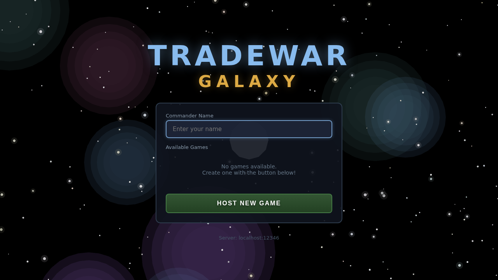
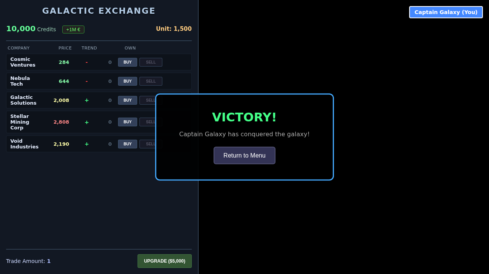

# TradeWar Galaxy

A space trading game built with React, Three.js, and TypeScript.

## Screenshots


*Game lobby - Create or join a game as a galactic commander*


*Galactic Exchange - Trade stocks and conquer the galaxy*

## Development

```bash
# Install dependencies
pnpm install

# Run development server
pnpm dev

# Build for production
pnpm build
```

## Deployment

This project is automatically deployed to GitHub Pages when changes are pushed to the `main` branch.

The live version is available at: https://srtobi.github.io/TradeWar3-ts/

### GitHub Pages Setup

The deployment is handled by a GitHub Actions workflow (`.github/workflows/deploy.yml`) that:
1. Builds the project using Vite
2. Uploads the build artifacts
3. Deploys to GitHub Pages

To enable GitHub Pages for this repository:
1. Go to repository Settings → Pages
2. Under "Build and deployment", select "GitHub Actions" as the source
3. The site will be automatically deployed on the next push to `main`

### Hetzner VPS Deployment

The project can also be deployed to a Hetzner VPS using the GitHub Actions workflow (`.github/workflows/deploy-hetzner.yml`). This deploys the full application including the WebSocket game server with automatic HTTPS support via Caddy.

#### Prerequisites

1. A Hetzner VPS with Docker installed
2. SSH access to the VPS
3. A domain name pointing to your VPS (for HTTPS)

#### Setup

1. Create a GitHub environment named `hetzner` in your repository settings (Settings → Environments → New environment)

2. Add the following secrets to the `hetzner` environment:
   - `HETZNER_HOST`: Your VPS IP address or hostname
   - `HETZNER_USERNAME`: SSH username (e.g., `root`)
   - `HETZNER_SSH_KEY`: Private SSH key for authentication
   - `HETZNER_SSH_PORT`: SSH port (optional, defaults to 22)
   - `DOMAIN`: Your domain name (e.g., `tradewar.example.com`) - **required for HTTPS**

3. Ensure Docker is installed on your Hetzner VPS:
   ```bash
   curl -fsSL https://get.docker.com | sh
   ```

4. Configure your DNS to point your domain to your VPS IP address

5. The workflow will automatically:
   - Clone the repository on your VPS
   - Build a Docker image with Caddy for automatic HTTPS
   - Deploy the container with persistent SSL certificate storage

#### HTTPS Support

The deployment uses [Caddy](https://caddyserver.com/) as a reverse proxy, which provides:
- **Automatic HTTPS certificates** from Let's Encrypt
- **Automatic certificate renewal**
- **Secure WebSocket connections (WSS)** for the game server

When deployed with a domain:
- The frontend is served over HTTPS on port 443
- HTTP requests on port 80 are automatically redirected to HTTPS
- WebSocket connections use the secure `wss://` protocol via the `/ws` path
- Caddy handles all TLS termination automatically

**Note:** Automatic HTTPS and HTTP→HTTPS redirection only work when a valid domain name is configured (not `localhost`).

#### Ports

The application exposes:
- Port 80: HTTP (automatically redirects to HTTPS when a valid domain is configured)
- Port 443: HTTPS (frontend and secure WebSocket)

Make sure these ports are open in your VPS firewall.

#### Connecting from GitHub Pages

To connect the GitHub Pages frontend to your VPS game server, add the server address as a URL parameter:

```
https://srtobi.github.io/TradeWar3-ts/?server=your-domain.com/ws
```

The `server` parameter supports several formats:
- `your-domain.com/ws` - Path-based connection (for Caddy proxy with HTTPS)
- `your-domain.com:12346` - Port-based connection (for direct connection)
- `your-domain.com` - Uses default port 12346

When accessed without the `server` parameter, the frontend attempts to connect to a game server on the same host.

## License

MIT
